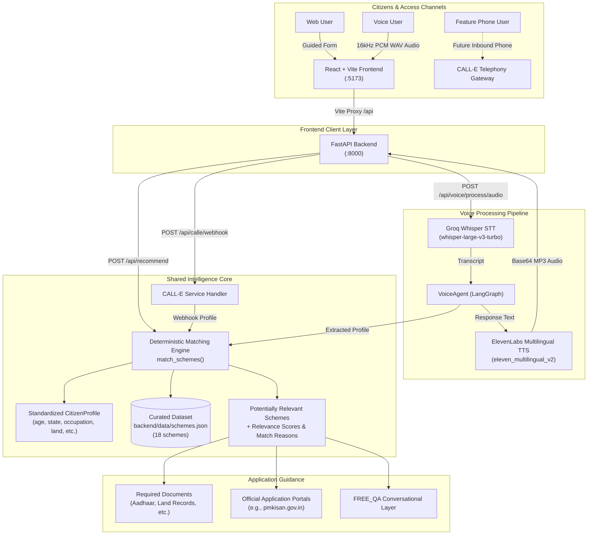
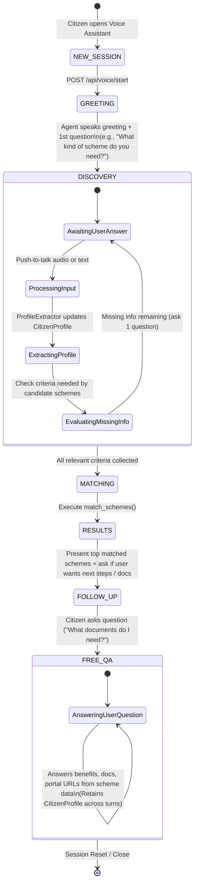

# YojnaSathi (योजनासाथी)

> **One Citizen Profile &rarr; One Shared Matching Engine &rarr; Web, Voice, and Phone Access &rarr; Schemes &amp; Application Guidance.**

[](https://fastapi.tiangolo.com)
[](https://react.dev)
[](https://vitejs.dev)
[](https://langchain-ai.github.io/langgraph/)
[](LICENSE)

YojnaSathi is a civic technology hackathon MVP designed to remove the friction between ordinary citizens and government welfare schemes. Instead of forcing citizens to navigate confusing bureaucracy, complex portals, and dense criteria tables, YojnaSathi provides a single, unified discovery platform available through three distinct entry points: **guided website forms**, an **agent-initiated voice assistant**, and an **integrated telephony channel (CALL-E)**.

---

## 1. Problem Statement

Across central and state administrations in India, hundreds of welfare programs, subsidies, scholarships, and insurance policies exist to empower citizens. However:

* **Fragmented Information:** Schemes are dispersed across dozens of department websites, gazettes, and separate application portals.
* **Complex Eligibility Criteria:** Rules involving land ownership, income ceilings, age brackets, and social categories make it difficult for citizens to know which programs apply to them.
* **Digital Literacy &amp; Accessibility Barriers:** Many rural workers, farmers, and elders cannot easily read lengthy web forms or navigate English-dominated portals.
* **Action Paralysis:** Even when citizens identify a scheme name, they often lack straightforward guidance on what documents to gather, where to submit forms, or how to reach official portals.

---

## 2. Solution

YojnaSathi unifies civic discovery through a simple paradigm:

```text
Citizen  ───►  [ Web Form | Voice Assistant | CALL-E Phone ]
                       │
                       ▼
           Standardized CitizenProfile
                       │
                       ▼
       Deterministic Shared Matching Engine
                       │
                       ▼
         Curated schemes.json Dataset
                       │
                       ▼
    Potentially Relevant Schemes + Application Guidance
```

* **Zero Duplication:** The website guided finder, the conversational voice assistant, and the CALL-E telephone layer all evaluate the exact same `CitizenProfile` through the same deterministic matching algorithm.
* **Trilingual by Design:** Fully supports **English**, **Hindi (हिन्दी)**, and **Marathi (मराठी)** across UI text, speech recognition, agent prompts, and text-to-speech synthesis.
* **Outcome-Focused:** Moves beyond mere list generation by presenting concrete benefits, required documents, and direct links to official government application portals.

---

## 3. Key Features

* `[IMPLEMENTED]` **Three Unified Access Modes:**
  * **Website Guided Finder:** Step-by-step progressive questionnaire asking one criteria question at a time.
  * **Voice Assistant:** Real-time push-to-talk voice interface with live audio equalizer, animated state-driven robot avatar, and transcript history.
  * **CALL-E Outbound Telephony Integration:** Backend routes and handlers for automated telephony discovery calls.
* `[IMPLEMENTED]` **Agent-Initiated Conversation:** When the voice assistant opens, the assistant greets the user and asks the first discovery question automatically without requiring the user to type or guess what to ask.
* `[IMPLEMENTED]` **Criteria-Aware Progressive Discovery:** Dynamically asks only the missing criteria questions (e.g., land ownership for farmers, social category for students) required by candidate schemes.
* `[IMPLEMENTED]` **Deterministic Scheme Matching:** Transparent, rule-based matching engine that checks eligibility constraints without hallucinating qualifications.
* `[IMPLEMENTED]` **Post-Match Free Q&A (FREE_QA):** Once schemes are retrieved, users can ask free-form follow-up questions (e.g., *"What documents do I need?"*, *"Where do I apply?"*), retaining their accumulated citizen profile.
* `[IMPLEMENTED]` **Application Guidance:** Scheme detail view highlighting key financial benefits, required verification documents, official application portal links, and offline office guidance notes.
* `[IMPLEMENTED]` **Full Trilingual Localization:** English, Hindi, and Marathi text in the UI, Whisper speech recognition, and ElevenLabs speech synthesis.
* `[MVP LIMITATION]` **Curated Scope:** Curated seed dataset of 18 central and Maharashtra state welfare schemes.
* `[MVP LIMITATION]` **Inbound Phone Number:** Inbound toll-free dialing is not currently provisioned (requires a paid inbound phone number). The website displays the Phone card as *"Coming Soon"*.
* `[FUTURE ROADMAP]` **Location-Aware Office Discovery:** District- and Taluka-level CSC/Setu Kendra mapping and website-driven "Call Me" callbacks.

---

## 4. Access Modes

| Mode | Target User | How It Works | Current Status |
| :--- | :--- | :--- | :--- |
| **🌐 Website Finder** | Citizens comfortable browsing the web | Progressive, 1-question-at-a-time form collecting age, state, occupation, land, and income | **`[IMPLEMENTED]`** Live on frontend |
| **🎙️ Voice Assistant** | Citizens who prefer speaking over typing or reading dense forms | Browser microphone capture &rarr; Groq Whisper STT &rarr; VoiceAgent &rarr; ElevenLabs TTS playback | **`[IMPLEMENTED]`** Live on frontend &amp; backend |
| **☎️ Phone / CALL-E** | Citizens without smartphones, computer access, or reliable internet | Automated phone conversation layer integrating CALL-E API with shared matching engine | **`[IMPLEMENTED]`** Backend endpoints ready<br>**`[MVP LIMITATION]`** Inbound phone number not provisioned; website card displays *"Coming Soon"* |

---

## 5. Architecture



---

## 6. Core Matching Engine

The matching engine in `backend/app/matching.py` evaluates a `CitizenProfile` against candidate schemes deterministically:

```python
match_schemes(profile: CitizenProfile, schemes: List[Scheme], category: Optional[str] = None) -> List[SchemeMatchResult]
```

### Deterministic Matching Rules:
1. **Hard Exclusions:** Disqualifies profiles that violate absolute eligibility rules (e.g., non-farmers for land-bound agriculture schemes, citizens exceeding verified income ceilings, or age outside explicit eligibility boundaries).
2. **Target Group Alignment:** Rewards matches (+3 score) for demographic alignment (farmers, students, women, street vendors, rural households).
3. **Criteria-Specific Matching:** Rewards matching criteria (+2 score) for specific social categories (SC/ST/OBC/EBC), state residency matches, and pucca house ownership status.
4. **Transparent Reason Codes:** Returns structured `reason_codes` (e.g., `TARGET_GROUP_FARMER`, `OCCUPATION_MATCH`, `STATE_MATCH`) explaining *why* the scheme was recommended.
5. **No False Guarantees:** All responses emphasize that recommendations represent **potentially relevant schemes**, and final legal eligibility is determined exclusively by the respective government authority.

---

## 7. Voice Conversation Flow



---

## 8. Voice Technology Pipeline

* **Speech-to-Text (STT):** Powered by Groq Cloud's `whisper-large-v3-turbo` model for sub-second vernacular audio transcription.
* **Text-to-Speech (TTS):** Powered by ElevenLabs' `eleven_multilingual_v2` model using account-owned voice profiles, returning high-fidelity audio in English, Hindi, and Marathi.
* **Browser Audio Capture:** Custom `useAudioRecorder` React hook capturing uncompressed **16 kHz, 16-bit, mono PCM WAV** via the Web Audio API without lossy container compression.
* **State Machine:** Built with **LangGraph**, transitioning cleanly through `greeting` &rarr; `discovery` &rarr; `results` &rarr; `free_qa`.

---

## 9. Application Guidance

YojnaSathi ensures citizens know their concrete next steps after discovering a scheme:

* **Official Online Application Links:** Direct URLs to primary government portals (e.g., `https://pmkisan.gov.in/`, `https://pmfby.gov.in/`, `https://nrega.nic.in/`).
* **Source Portals:** Secondary links to official scheme informational portals (e.g., `https://www.myscheme.gov.in/`).
* **Required Documentation Checklist:** Specific document lists for each scheme (Aadhaar, Land 7/12 extract, bank passbook, income certificate, caste certificate).
* **Offline Channel Notes:** Guidance on visiting designated local authorities (e.g., Gram Panchayat, Agriculture Officer, CSC centers) where offline applications are supported.

---

## 10. CALL-E Telephony Integration

The repository includes a complete telephony integration layer in `backend/services/calle/`:

* `POST /api/calle/call`: Initiates an outbound conversational call to a citizen's telephone number.
* `GET /api/calle/call/{call_id}`: Polls call status, transcript summaries, and matched schemes.
* `POST /api/calle/webhook`: Receives terminal webhook events from CALL-E, parses structured citizen attributes, and runs them through `match_schemes()`.

> **`[MVP LIMITATION]` Inbound Phone Number Availability:**
> Autonomous inbound public phone access requires a provisioned paid inbound phone number from the telephony carrier, which is not currently provisioned for this hackathon environment. The website gateway displays the Phone option as **"Coming Soon"** with an explanatory note. Outbound call initiation routes are implemented and functional backend-side.

---

## 11. Curated Scheme Dataset

The dataset in `backend/data/schemes.json` contains 18 curated central and state schemes:

| Scheme ID | Scheme Name | Category | Scope | Key Benefit |
| :--- | :--- | :--- | :--- | :--- |
| `pm-kisan` | PM Kisan Samman Nidhi | Agriculture | All-India | ₹6,000/year direct bank transfer |
| `pmfby` | PM Fasal Bima Yojana | Agriculture | All-India | Subsidized crop damage insurance |
| `pm-jay` | Ayushman Bharat PM-JAY | Healthcare | All-India | ₹5 Lakh/year health cover |
| `mjpjay` | Mahatma Jyotirao Phule Jan Arogya | Healthcare | Maharashtra | ₹5 Lakh/year cashless hospital cover |
| `pm-svanidhi` | PM SVANidhi | Small Business | All-India | Working capital loans up to ₹50,000 |
| `pmmy` | Pradhan Mantri Mudra Yojana | Small Business | All-India | Business loans up to ₹10 Lakh |
| `pmjdy` | Pradhan Mantri Jan Dhan Yojana | Finance | All-India | Zero-balance bank account + ₹2L insurance |
| `pm-ujjwala` | Pradhan Mantri Ujjwala Yojana | Women | All-India | Free LPG cooking gas connection |
| `pmmvy` | Pradhan Mantri Matru Vandana Yojana | Women | All-India | ₹5,000 maternity cash benefit |
| `majhi-ladki-bahin` | Mukhyamantri Majhi Ladki Bahin | Women | Maharashtra | ₹1,500/month financial assistance |
| `pmay-g` | PMAY - Gramin | Housing | All-India | ₹1.20L–₹1.30L assistance for rural pucca house |
| `pmay-u` | PMAY - Urban | Housing | All-India | Interest subsidy for urban housing |
| `pm-yasasvi` | PM YASASVI Scholarship | Education | All-India | ₹75,000–₹1,25,000/year scholarship |
| `post-matric-sc` | Post Matric Scholarship for SC | Education | All-India | Full tuition waiver + maintenance allowance |
| `mgnrega` | MGNREGA | Employment | All-India | 100 days guaranteed rural wage employment |
| `pmkvy` | PM Kaushal Vikas Yojana | Employment | All-India | Free skill certification + ₹8,000 stipend |
| `apy` | Atal Pension Yojana | Finance | All-India | ₹1,000–₹5,000 monthly pension after age 60 |
| `pmsby` | PM Suraksha Bima Yojana | Finance | All-India | ₹2 Lakh accidental death/disability insurance |

---

## 12. Tech Stack

| Layer | Technology | Exact Version / Spec | Purpose |
| :--- | :--- | :--- | :--- |
| **Frontend Framework** | React | `^18.3.1` | Reactive user interface &amp; state management |
| **Frontend Tooling** | Vite | `^6.0.0` | High-speed build tooling &amp; dev proxy server |
| **HTTP Client** | Axios | `^1.7.9` | API communication with backend |
| **Backend Framework** | FastAPI | `>=0.110.0` | Asynchronous REST API layer |
| **ASGI Server** | Uvicorn | `>=0.28.0` | High-performance ASGI web server |
| **Data Validation** | Pydantic | `>=2.6.0` | Structured schema definition &amp; serialization |
| **Agent Orchestration** | LangGraph | `>=0.0.10` | Stateful multi-turn conversation graph |
| **LLM Integration** | LangChain / Google GenAI | `>=1.4.0` / `>=4.4.0` | Intent parsing &amp; information extraction |
| **Speech-to-Text** | Groq Cloud (Whisper) | `whisper-large-v3-turbo` | Vernacular speech audio transcription |
| **Text-to-Speech** | ElevenLabs | `eleven_multilingual_v2` | Natural multi-language voice synthesis |
| **Telephony Gateway** | CALL-E API | REST + Webhook | Outbound scheme discovery phone calls |
| **Language Runtime** | Python | `>=3.10` | Core backend language |

---

## 13. Project Structure

```text
YojnaSathi/
├── .env.example                     # Root environment variable template
├── README.md                        # Project documentation
│
├── backend/
│   ├── requirements.txt             # Python dependencies
│   ├── .env.example                 # Backend environment variable template
│   ├── app/
│   │   ├── main.py                  # FastAPI application entry point & routes
│   │   ├── schemas.py               # Pydantic data models (CitizenProfile, Scheme, etc.)
│   │   ├── matching.py              # Deterministic rule-based scheme matching engine
│   │   └── ai.py                    # LLM chat & profile merging service
│   ├── data/
│   │   └── schemes.json             # 18 curated government schemes dataset
│   └── services/
│       ├── calle/                   # CALL-E phone channel integration
│       │   ├── routes.py            # /api/calle/call, /api/calle/webhook
│       │   ├── service.py           # CALL-E API client & webhook profile mapper
│       │   ├── schemas.py           # Call request, status, and webhook schemas
│       │   └── exceptions.py        # Custom telephony exceptions
│       ├── stt/                     # Speech-to-Text adapters (Groq Whisper, Mock, Gemini)
│       │   └── service.py
│       ├── tts/                     # Text-to-Speech adapters (ElevenLabs, Mock, Gemini)
│       │   └── service.py
│       └── voice_agent/             # LangGraph state machine & conversation flow
│           ├── agent.py             # VoiceAgent class (start, process, reset)
│           ├── graph.py             # LangGraph workflow, discovery, & FREE_QA nodes
│           ├── state.py             # AgentState TypedDict definition
│           ├── extractor.py         # Vernacular profile extractor & alias resolver
│           └── prompts.py           # Core system prompts
│
└── frontend/
    ├── package.json                 # Node.js dependencies & scripts
    ├── vite.config.js               # Vite config with /api reverse proxy
    ├── .env.example                 # Frontend environment variable template
    ├── index.html                   # HTML entry page
    └── src/
        ├── main.jsx                 # React root mount
        ├── App.jsx                  # Top-level view router & state container
        ├── api.js                   # API client (Axios) methods
        ├── index.css                # Civic design system styles
        ├── constants/
        │   ├── strings.js           # Full trilingual localization dictionary (EN, HI, MR)
        │   ├── languages.js         # Supported languages list
        │   ├── questionnaires.js    # Guided category finder step definitions
        │   └── config.js            # Frontend phone configuration helper
        ├── hooks/
        │   ├── useAudioRecorder.js  # 16kHz mono PCM WAV browser microphone recorder
        │   ├── useAudioPlayer.js    # Audio playback hook for TTS responses
        │   └── useMediaQuery.js     # Responsive viewport breakpoint hook
        └── components/
            ├── Header.jsx           # Global header with language selector
            ├── GatewayHero.jsx      # 3-door entry gateway (Web, Voice, Phone)
            ├── CategoryGrid.jsx     # Quick-topic category selection rail
            ├── Questionnaire.jsx    # Progressive 1-question-at-a-time finder
            ├── ResultsView.jsx      # Matched scheme results view
            ├── SchemeCard.jsx       # Scheme summary card with match reasons
            ├── SchemeDetailModal.jsx# Full details modal (benefits, docs, official link)
            └── VoiceAssistant/
                ├── VoiceAssistantView.jsx  # Floating launcher & panel orchestrator
                ├── VoicePanel.jsx          # Expanded conversation & microphone dock
                ├── RobotAvatar.jsx         # Inline state-driven SVG avatar
                ├── FloatingRobot.jsx       # Floating action button
                ├── MessageBubble.jsx       # Conversation turns with audio replay
                └── ConversationInputDock.jsx# Text input fallback dock
```

---

## 14. API Documentation

| Method | Endpoint | Description | Key Parameters / Payload |
| :--- | :--- | :--- | :--- |
| `GET` | `/api/health` | Service health status check | None |
| `GET` | `/api/schemes` | Retrieve all schemes with optional filters | Query: `category`, `state`, `target_group` |
| `GET` | `/api/schemes/{id}` | Retrieve a single verified scheme by ID | Path: `id` (e.g., `pm-kisan`) |
| `POST` | `/api/recommend` | Deterministic scheme matching for profile | Body: `{ "profile": {...}, "category": "farmers" }` |
| `POST` | `/api/chat` | Conversational text assistant with Gemini | Body: `{ "message": "...", "profile": {...} }` |
| `POST` | `/api/voice/start` | Agent-first voice session start (greeting + 1st question) | Body: `{ "session_id": "...", "language": "hi" }` |
| `POST` | `/api/voice/process` | Process text message through VoiceAgent | Body: `{ "session_id": "...", "message": "...", "language": "en" }` |
| `POST` | `/api/voice/process/audio` | Full voice round-trip (Audio &rarr; STT &rarr; Agent &rarr; TTS) | Multipart: `audio` (WAV/MP3), `session_id`, `language` |
| `POST` | `/api/voice/reset` | Reset conversation state for session ID | Body: `{ "session_id": "..." }` |
| `POST` | `/api/calle/call` | Initiate outbound phone discovery call | Body: `{ "phone_number": "+91...", "language": "hi" }` |
| `GET` | `/api/calle/call/{id}` | Get status and matched schemes of a call | Path: `id` |
| `POST` | `/api/calle/webhook` | Webhook receiver for terminal CALL-E events | Header: `CALL-E-Event-Id`, Body: CALL-E webhook JSON |

---

## 15. Local Development Setup

Follow these instructions to run both services on Windows (PowerShell):

### Prerequisites
* Python 3.10 or higher
* Node.js 18 or higher (with npm)
* Git

### 1. Backend Setup

```powershell
# Navigate to backend directory
cd D:\OMKAR\Projects\YojnaSathi\backend

# Create virtual environment
python -m venv .venv

# Activate virtual environment
.venv\Scripts\Activate.ps1

# Install dependencies
pip install -r requirements.txt

# Copy environment template
cp .env.example .env

# Configure environment variables in backend/.env with your text editor:
# GEMINI_API_KEY, WHISPER_API_KEY (Groq), ELEVENLABS_API_KEY, ELEVENLABS_VOICE_ID

# Start FastAPI backend server (port 8000)
python -m uvicorn app.main:app --reload --host 0.0.0.0 --port 8000
```

Verify backend health at: `http://localhost:8000/api/health`

### 2. Frontend Setup

Open a second PowerShell terminal:

```powershell
# Navigate to frontend directory
cd D:\OMKAR\Projects\YojnaSathi\frontend

# Install dependencies
npm install

# Copy environment template
cp .env.example .env

# Start Vite development server (port 5173)
npm run dev
```

Open your browser at: `http://localhost:5173`

*(The Vite development server is configured with a reverse proxy forwarding `/api` requests to `http://127.0.0.1:8000`)*.

---

## 16. Environment Variables

> **Security Note:** Never commit `.env` files to git. Keep real credentials strictly in your local `.env`.

| Variable | Component | Purpose | Status |
| :--- | :--- | :--- | :--- |
| `GEMINI_API_KEY` | Backend | LLM extraction and chat assistant | Required for `/api/chat` &amp; LLM extraction |
| `GEMINI_MODEL` | Backend | Model identifier (defaults to `gemini-2.5-flash`) | Optional |
| `STT_PROVIDER` | Backend | Speech-to-text engine (`groq`, `whisper`, `mock`) | Required (defaults to `groq`) |
| `TTS_PROVIDER` | Backend | Text-to-speech engine (`elevenlabs`, `gemini`, `mock`) | Required (defaults to `elevenlabs`) |
| `WHISPER_API_KEY` | Backend | Groq Cloud API key for Whisper transcription | Required when `STT_PROVIDER=groq` |
| `WHISPER_BASE_URL` | Backend | Endpoint URL (defaults to `https://api.groq.com/openai/v1`) | Optional |
| `WHISPER_MODEL` | Backend | Whisper model name (defaults to `whisper-large-v3-turbo`) | Optional |
| `ELEVENLABS_API_KEY` | Backend | ElevenLabs API key for voice synthesis | Required when `TTS_PROVIDER=elevenlabs` |
| `ELEVENLABS_VOICE_ID` | Backend | Account-owned ElevenLabs voice identifier | Required when `TTS_PROVIDER=elevenlabs` |
| `ELEVENLABS_MODEL` | Backend | Model name (defaults to `eleven_multilingual_v2`) | Optional |
| `ELEVENLABS_VOICE_EN` | Backend | Optional language-specific voice ID override for English | Optional |
| `ELEVENLABS_VOICE_HI` | Backend | Optional language-specific voice ID override for Hindi | Optional |
| `ELEVENLABS_VOICE_MR` | Backend | Optional language-specific voice ID override for Marathi | Optional |
| `CALLE_API_KEY` | Backend | API key for CALL-E telephony service | Optional (leave commented if unused) |
| `CALLE_BASE_URL` | Backend | CALL-E API URL (defaults to `https://api.heycall-e.com`) | Optional |
| `CALLE_WEBHOOK_URL` | Backend | Public HTTPS URL where CALL-E sends status webhooks | Optional |
| `VITE_API_BASE_URL` | Frontend | Backend API target (defaults to `http://localhost:8000`) | Optional |
| `VITE_CALL_PHONE_NUMBER` | Frontend | Configured E.164 phone number for live `tel:` link | Optional (when unset, shows "Coming Soon") |

---

## 17. Testing & Verification

The repository includes a comprehensive test suite covering matching logic, telephony endpoints, providers, and voice agent conversation graphs:

### Test Files:
* `backend/test_calle.py`: CALL-E service, webhook verification, error mapping, and payload validation.
* `backend/test_providers.py`: Mock/real STT and TTS provider contracts, content type checks, and audio encoding.
* `backend/test_voice_agent.py`: Agent-first start, LangGraph state progression, criteria-aware discovery, and FREE_QA turn tests.
* `backend/test_voice_audio_endpoint.py`: Multipart `/api/voice/process/audio` round-trip tests with WAV/MP3 uploads.

```powershell
# Run backend test suite (from backend directory)
cd backend
.venv\Scripts\Activate.ps1
pytest -q

# Run frontend production build validation (from frontend directory)
cd frontend
npm run build
```

> **Verification Status:**
> *Previously verified during development:* 46/46 unit and integration tests passing in `pytest -q`, and clean production frontend bundle compiled in `npm run build` with 0 errors. *(Note: Full test suites were not re-executed during this documentation task).*

---

## 18. Security & Privacy

* **Strict Backend Isolation:** All API keys (Groq, ElevenLabs, Gemini, CALL-E) reside strictly on the backend server in local `.env` files and are never exposed to client-side bundles or headers.
* **No PII Persistence:** Citizen profile attributes (age, land ownership, income range) are stored transiently in memory keyed by ephemeral session IDs and are not stored in any external database.
* **No Sensitive Identification Demanded:** YojnaSathi's system prompt strictly prohibits asking for or accepting Aadhaar numbers, PAN cards, OTPs, bank passwords, or UPI PINs.
* **Safe Telephony Fallbacks:** Missing telephony credentials fail safely with standard HTTP error codes rather than exposing stack traces or API tokens.

---

## 19. MVP Limitations

To maintain strict hackathon honesty, the following constraints are acknowledged:

1. **Curated Dataset:** Covers 18 high-priority central and Maharashtra state schemes rather than an exhaustive index of all national programs.
2. **Advisory Matching Only:** YojnaSathi identifies *potentially relevant schemes*; it does not make binding or legal eligibility determinations.
3. **Inbound Telephony Public Line:** Autonomous inbound public calling is not currently provisioned because a dedicated paid carrier telephone number has not been allocated.
4. **No Taluka/District Mapping:** Geolocation-aware filtering down to specific Talukas, Gram Panchayats, or physical Common Service Center (CSC) offices is not yet implemented.

---

## 20. Future Roadmap

* **Phase Next: District &amp; Taluka Localization:**
  * Collect District and Taluka during discovery to map citizens directly to nearby Setu Kendras, CSC centers, and Taluka Agriculture Offices.
* **Website "Call Me" Flow:**
  * Add a web form allowing citizens to input their mobile number to receive an instant outbound call from CALL-E without needing a smartphone browser.
* **Inbound Toll-Free Line:**
  * Provision a dedicated toll-free inbound number so citizens can call YojnaSathi directly from any feature phone or landline.
* **Expanded Scheme Coverage:**
  * Ingest and verify additional state-specific welfare datasets beyond Maharashtra.
* **Additional Vernacular Languages:**
  * Expand voice and questionnaire support to Gujarati, Tamil, Telugu, and Bengali.

---

## 21. Live Demo Walkthrough (60–90 Seconds)

### Scenario:
A 42-year-old farmer from Maharashtra owning cultivable agricultural land needs financial and crop support.

```text
Step 1: Open Website (http://localhost:5173)
        View 3-door landing: "Find Schemes Online", "Speak with YojnaSathi", "Call YojnaSathi" (Coming Soon).

Step 2: Guided Website Finder
        Select "Farmers" category &rarr; Enter Age (42) &rarr; State (Maharashtra) &rarr; Land Ownership (Yes).

Step 3: Instant Recommendation Results
        Matched Schemes:
        1. PM-KISAN (Score 6/10 — ₹6,000/yr direct income support)
        2. PMFBY (Score 5/10 — subsidized crop damage insurance)
        Click "View Details" to see required documents (Aadhaar, 7/12 land extract) and official portal link (pmkisan.gov.in).

Step 4: Voice Assistant Interaction
        Tap floating robot &rarr; Agent speaks immediately:
        "Hello! Let's find government schemes for you. What kind of scheme do you need: farming, education, health, or housing?"
        Say: "I am 42 years old and I am a farmer from Maharashtra."
        Agent asks: "Do you own agricultural land?"
        Say: "Yes."
        Agent announces PM-KISAN and PMFBY.

Step 5: Post-Match Free Q&A (FREE_QA)
        Ask: "What documents do I need?"
        Agent responds with exact required documents for PM-KISAN and PMFBY, retaining the farmer profile.
```

---

## 22. Hackathon Value & Civic Impact

* **Inclusive Civic Access:** Bridges the digital divide by offering identical recommendation intelligence across visual web forms, speech-driven browser interaction, and telephone calls.
* **Architectural Modularity:** Built on an extensible foundation where adding a new scheme to `schemes.json` instantly upgrades the Website Finder, Voice Assistant, and CALL-E phone channel simultaneously.
* **Actionable Outcomes:** Solves the "what now?" problem by delivering verified application portals and required document checklists directly into the citizen's hands.

---

## 23. Disclaimer

*YojnaSathi is a civic technology demonstration platform developed for hackathon evaluation. Scheme information is compiled from published public guidelines. Scheme recommendations indicate potential relevance and do not constitute official government eligibility approvals. Final eligibility verification and benefit disbursement are determined solely by the respective government ministries, state departments, and competent administrative authorities. Citizens are advised to verify official guidelines at official portals before submitting applications.*

---

## Web Scheme Discovery (Parallel Pipeline)

A **completely separate, optional** pipeline that discovers government schemes beyond the 18 curated local schemes, using Tavily web search. It never touches the existing deterministic matcher.

```text
Citizen Profile
       ↓
Tavily Discovery (3–6 targeted queries: state + occupation + need, central + state)
       ↓
Candidate Extraction (deterministic, evidence-traced — never invents facts)
       ↓
Source Validation (Tier 1 .gov.in / Tier 2 portals verify; blogs/forums cannot)
       ↓
Deduplication (normalized names + aliases + official URLs, e.g. PM-KISAN variants)
       ↓
Validated Web Schemes  →  (FUTURE) Final Merger with local matching.py results
```

* **Independent:** does not import or modify `backend/app/matching.py`, `backend/data/schemes.json`, `services/voice_agent/`, or `services/calle/`. If Tavily is down or unconfigured, `/api/recommend` and all voice/CALL-E routes work normally.
* **Endpoint:** `POST /api/web-schemes/search` with `{ "profile": { "state": "Maharashtra", "occupation": "farmer", "specific_need": "crop support" } }` → `{ "status", "query_summary", "validated_schemes": [...], "rejected_candidates": [...], "metadata": {...} }`. Only `validation_status=verified` **and** `active_status=active` schemes appear in `validated_schemes`; everything else is kept in `rejected_candidates` for debugging. Health probe: `GET /api/web-schemes/health`.
* **Code:** `backend/services/web_scheme_discovery/` (`service.py`, `schemas.py`, `tavily_search.py`, `extractor.py`, `validator.py`, `deduplicator.py`, `prompts.py`, `source_policy.py`, `cache.py`, `exceptions.py`, `routes.py`). Merger-ready interface: `discover_web_schemes(profile)` — the future merger calls this without knowing about Tavily. The final merger itself is **not** implemented yet.
* **Environment (all optional, key never hardcoded/logged):** `TAVILY_API_KEY` (required only for live search), `TAVILY_MAX_RESULTS`, `TAVILY_SEARCH_DEPTH` (`basic` default), `WEB_SCHEME_CACHE_TTL`, `WEB_SCHEME_MAX_CANDIDATES`, `WEB_SCHEME_VALIDATION_TIMEOUT`. See `backend/.env.example`.
* **Safety:** only the minimum query terms (state, occupation/role, need) are sent to Tavily — exact age/income/disability never leave the server. Unknown fields stay `null`, never invented. Responses use "may be relevant" phrasing only.
* **Tests:** `backend/test_web_scheme_discovery.py` — fully mocked, no network by default (20 tests). Live check only with `RUN_TAVILY_INTEGRATION_TEST=true` plus a real key.

---

## 24. Development Team & Acknowledgments

Developed with ❤️ for Indian citizens by:

* **Omkar** and **Aditya**
