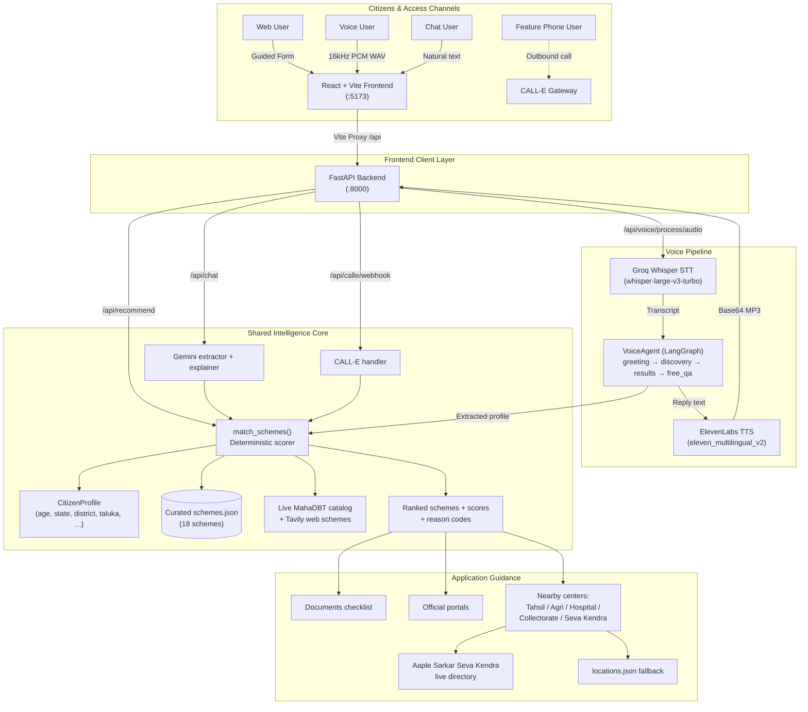
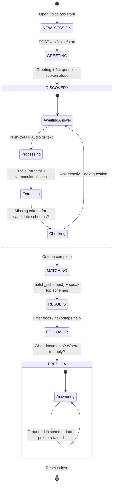

# YojnaSathi (योजनासाथी)

> **One Citizen Profile → One Shared Matching Engine → Web, Voice, and Phone Access → Schemes + Where-To-Apply Guidance.**

[](https://fastapi.tiangolo.com)
[](https://react.dev)
[](https://vitejs.dev)
[](https://langchain-ai.github.io/langgraph/)
[](LICENSE)

**Live Demo:** [https://yojnasathi-1.onrender.com/](https://yojnasathi-1.onrender.com/)

YojnaSathi is a civic-tech platform that removes the friction between ordinary citizens and government welfare schemes. Instead of forcing citizens to navigate dozens of department portals, gazettes, and dense eligibility tables, it offers a single unified discovery platform with three entry points — a **guided website finder**, an **agent-initiated voice assistant**, and an **integrated telephony channel (CALL-E)** — all powered by the same deterministic matching engine and the same verified scheme data.

What makes this project different from a “scheme list” app is the **outcome focus**: every recommendation ships with concrete next steps — official portal links, required-document checklists, and **location-aware physical application centers near the citizen**, including **live Aaple Sarkar Seva Kendra / Maha e-Seva / Setu Kendra / CSC centers** resolved for the user’s own state → district → taluka.

---

## Table of Contents

1. [Problem Statement](#1-problem-statement)
2. [Solution Overview](#2-solution-overview)
3. [Key Features](#3-key-features)
4. [Access Modes](#4-access-modes)
5. [Architecture](#5-architecture)
6. [Tech Stack](#6-tech-stack)
7. [Project Structure](#7-project-structure)
8. [Curated Scheme Dataset (18 Schemes)](#8-curated-scheme-dataset-18-schemes)
9. [Core Matching Engine](#9-core-matching-engine)
10. [Guided Website Finder (7 Categories)](#10-guided-website-finder-7-categories)
11. [Location-Aware Application Centers (incl. Maha e-Seva Kendra)](#11-location-aware-application-centers-incl-maha-e-seva-kendra)
12. [Voice Assistant & Voice Pipeline](#12-voice-assistant--voice-pipeline)
13. [Text Chat Assistant](#13-text-chat-assistant)
14. [CALL-E Telephony Integration](#14-call-e-telephony-integration)
15. [Live Scheme Discovery (MahaDBT + Web/Tavily)](#15-live-scheme-discovery-mahadbt--webtavily)
16. [Application Guidance (What Do I Do Next?)](#16-application-guidance-what-do-i-do-next)
17. [API Documentation](#17-api-documentation)
18. [Frontend Guide](#18-frontend-guide)
19. [Trilingual Localization](#19-trilingual-localization)
20. [Local Development Setup](#20-local-development-setup)
21. [Environment Variables](#21-environment-variables)
22. [Testing & Verification](#22-testing--verification)
23. [Security & Privacy](#23-security--privacy)
24. [MVP Limitations](#24-mvp-limitations)
25. [Future Roadmap](#25-future-roadmap)
26. [Live Demo Walkthrough (60–90 Seconds)](#26-live-demo-walkthrough-6090-seconds)
27. [Hackathon Value & Civic Impact](#27-hackathon-value--civic-impact)
28. [Disclaimer](#28-disclaimer)
29. [Development Team](#29-development-team--acknowledgments)

---

## 1. Problem Statement

Across central and state administrations in India, hundreds of welfare programs, subsidies, scholarships, and insurance policies exist. However:

* **Fragmented Information:** Schemes are scattered across dozens of department websites, gazettes, and separate portals (`pmkisan.gov.in`, `mahadbt.maharashtra.gov.in`, `myscheme.gov.in`, …).
* **Complex Eligibility:** Rules involving land ownership, income ceilings, age brackets, gender, and social categories (SC/ST/OBC/EBC) make it hard to know what applies.
* **Digital-literacy & Language Barriers:** Rural workers, farmers, and elders often cannot read long English forms or navigate dense portals.
* **“Where do I apply?” Gap:** Even when a citizen knows a scheme name, they don’t know what documents to gather, which portal is official, or **which physical office near them** (Tahsil office, Krishi office, Civil Hospital, Seva Kendra) actually accepts the application.
* **Action Paralysis:** Discovery without guidance does not convert into submitted applications.

---

## 2. Solution Overview

```text
Citizen ───► [ Web Form | Voice Assistant | CALL-E Phone | Chat ]
                        │
                        ▼
            Standardized CitizenProfile
      (age, state, district, taluka, occupation,
       income, land, house, category, needs…)
                        │
                        ▼
        Deterministic Shared Matching Engine
                 match_schemes()
                        │
                        ▼
   Curated schemes.json (18) + Live MahaDBT + Tavily Web
                        │
                        ▼
   Potentially Relevant Schemes + Scores + Reasons
              + Official Portals + Documents
              + Nearby Application Centers
```

* **Zero Duplication:** Website finder, voice agent, chat endpoint, and CALL-E phone layer all evaluate the same `CitizenProfile` through the same `match_schemes()` function in `backend/app/matching.py`.
* **Trilingual by Design:** English, Hindi (हिन्दी), and Marathi (मराठी) across UI text, speech recognition, agent prompts, and speech synthesis.
* **Outcome-Focused:** Every result carries benefits, required documents, official links, and a **“Where to Apply”** card with physical offices.
* **Never Fabricates:** Offline centers are only shown when verified from the curated catalog or a live `*.gov.in` source. No invented addresses, phones, or eligibility guarantees.

---

## 3. Key Features

| # | Feature | Status | Where |
|---|---------|--------|-------|
| 1 | **Guided website finder** — 1-question-at-a-time flow across 7 categories (Farmers, Women, Education, Healthcare, Housing, Employment, Small Business) | `[IMPLEMENTED]` | `frontend/src/constants/questionnaires.js`, `Questionnaire.jsx` |
| 2 | **Dynamic State → District → Taluka** — authoritative 28 States + 8 UTs list; live official district/taluka discovery from `*.gov.in` with graceful fallback | `[IMPLEMENTED]` | `backend/app/government_locations.py`, `frontend/src/hooks/useApplicationOptions.js` |
| 3 | **Deterministic scheme matching** — rule-based scoring, hard exclusions, transparent reason codes, no hallucinated eligibility | `[IMPLEMENTED]` | `backend/app/matching.py` |
| 4 | **Location-aware application centers** — scheme-aware offices (Tahsil/Setu, Agriculture, Civil Hospital, Collectorate, Commissionerate) resolved by state/district/taluka | `[IMPLEMENTED]` | `backend/app/locations.py`, `backend/app/location_search.py`, `backend/data/locations.json` |
| 5 | **Live Maha e-Seva / Aaple Sarkar Seva Kendra lookup** — real-time VLE centers for the citizen’s own district + taluka from `aaplesarkar.mahaonline.gov.in` (district dropdown → taluka API → center table), with strict taluka filtering and de-duplication | `[IMPLEMENTED]` | `MaharashtraSewaKendraProvider` in `backend/app/location_search.py` |
| 6 | **Multi-source official location search** — scheme-notice authority extraction + district directory parsing + CSC/Setu targeting, corroborated before display; Serper / Google CSE backends; verified-catalog fallback | `[IMPLEMENTED]` | `GovernmentWebSearchProvider`, `OfficialPortalLocationProvider` in `backend/app/location_search.py` |
| 7 | **Unified application-options endpoint** — one call returns online portal + physical centers + verification status (`live_official_source` / `local_catalog_fallback` / `none`) with bounded caching | `[IMPLEMENTED]` | `GET /api/application-options`, `find_application_options()` |
| 8 | **Voice assistant (agent-initiated)** — opens with greeting + first question, no typing needed; push-to-talk mic, live equalizer, robot avatar, transcript history, text fallback | `[IMPLEMENTED]` | `backend/services/voice_agent/`, `frontend/src/components/VoiceAssistant/` |
| 9 | **Full voice pipeline** — 16 kHz mono PCM WAV capture → Groq Whisper STT → LangGraph VoiceAgent → ElevenLabs TTS (MP3 base64) | `[IMPLEMENTED]` | `backend/services/stt/`, `backend/services/tts/`, `POST /api/voice/process/audio` |
| 10 | **Post-match FREE_QA** — after results, ask “What documents do I need?”, “Where do I apply?” while retaining profile | `[IMPLEMENTED]` | `backend/services/voice_agent/graph.py` |
| 11 | **Text chat assistant** — Gemini profile extraction + deterministic matching + grounded explanation with safety phrasing | `[IMPLEMENTED]` | `backend/app/ai.py`, `POST /api/chat` |
| 12 | **CALL-E telephony** — outbound call initiation, status polling, webhook ingestion mapped through `match_schemes()` | `[IMPLEMENTED]` backend; `[MVP LIMITATION]` inbound number not provisioned | `backend/services/calle/` |
| 13 | **Live Maharashtra (MahaDBT) discovery** — supplements curated data for Maharashtra citizens from `mahadbt.maharashtra.gov.in/SchemeList/SchemeListAtoZ`, cached 6 h, never breaks `/api/recommend` | `[IMPLEMENTED]` | `backend/services/maharashtra_schemes/service.py` |
| 14 | **Web scheme discovery (Tavily)** — independent parallel pipeline (search → extract → validate → dedupe) + merger into `/api/recommend` + standalone `/api/web-schemes/search` | `[IMPLEMENTED]` | `backend/services/web_scheme_discovery/` |
| 15 | **Full trilingual UI + voice** — EN/HI/MR strings, localized scheme names/benefits/addresses/working hours | `[IMPLEMENTED]` | `frontend/src/constants/strings.js`, `getLocalizedField()` |
| 16 | **Lazy on-demand location loading** — recommendations stay fast; centers load per-scheme via `useApplicationOptions` with concurrency limits | `[IMPLEMENTED]` | `frontend/src/hooks/useApplicationOptions.js`, `ApplicationLocationsList.jsx` |

---

## 4. Access Modes

| Mode | Target User | How It Works | Status |
| :--- | :--- | :--- | :--- |
| **🌐 Website Finder** | Citizens comfortable browsing | Progressive 1-question flow (age → state → district → taluka → category-specific questions) → `POST /api/recommend` | `[IMPLEMENTED]` Live |
| **🎙️ Voice Assistant** | Citizens who prefer speaking | Mic capture → `POST /api/voice/start` (greeting) → `POST /api/voice/process/audio` (STT → agent → TTS) → spoken + text results | `[IMPLEMENTED]` Live |
| **💬 Text Chat** | Citizens who type naturally | `POST /api/chat` → Gemini extracts profile → `match_schemes()` → grounded explanation or clarifying question | `[IMPLEMENTED]` Live |
| **☎️ Phone / CALL-E** | Feature-phone / no-internet users | Outbound AI call → webhook → shared matcher; inbound `tel:` link activates once a number is configured | `[IMPLEMENTED]` backend; `[MVP LIMITATION]` inbound number = “Coming Soon” card |
| **🌍 Web Discovery** | Power users / judges | Optional “search web for more schemes” via Tavily; merged into recommendations when available | `[IMPLEMENTED]` Optional |

---

## 5. Architecture



---

## 6. Tech Stack

| Layer | Technology | Version / Spec | Purpose |
| :--- | :--- | :--- | :--- |
| Frontend Framework | React | `^18.3.1` | UI + state |
| Build Tool | Vite | `^6.0.0` | Dev server, `/api` proxy, production bundle |
| HTTP Client | Axios | `^1.7.9` | API calls, retries, timeouts |
| Backend Framework | FastAPI | `>=0.110.0` | Async REST API |
| ASGI Server | Uvicorn | `>=0.28.0` | Production server |
| Validation | Pydantic | `>=2.6.0` | `CitizenProfile`, `Scheme`, `ApplicationLocation` schemas |
| Agent Orchestration | LangGraph | `>=0.0.10` | Voice state machine |
| LLM | LangChain + Google Gemini | `>=1.4.0` / `>=4.4.0` (`gemini-2.5-flash` default) | Chat extraction + explanations |
| STT | Groq Whisper | `whisper-large-v3-turbo` | Vernacular transcription |
| TTS | ElevenLabs | `eleven_multilingual_v2` | EN/HI/MR voice synthesis |
| Telephony | CALL-E API | REST + webhook | Outbound discovery calls |
| Web Search (schemes) | Tavily | `TAVILY_API_KEY` (optional) | Parallel scheme discovery |
| Web Search (locations) | Serper / Google CSE | `SERPER_API_KEY` or CSE key (optional) | Official office discovery |
| Live Directories | `*.gov.in` / `*.nic.in` / `aaplesarkar.mahaonline.gov.in` / `mahadbt.maharashtra.gov.in` | HTTPS scraping + validation | Districts, talukas, Seva Kendras, state schemes |
| Runtime | Python | `>=3.10` | Backend |
| Runtime | Node.js | `>=18` | Frontend |

---

## 7. Project Structure

```text
YojnaSathi/
├── .env.example                  # Root env template (PORT, Gemini, location search)
├── README.md                     # This file
├── backend/
│   ├── requirements.txt          # fastapi, uvicorn, pydantic, httpx, langchain, langgraph…
│   ├── .env.example              # Backend env template (Gemini, STT/TTS, CALL-E, Tavily, Serper)
│   ├── conftest.py               # pytest path bootstrap
│   ├── test_*.py                 # 13 test modules (matching, voice, calle, locations, merger…)
│   ├── app/
│   │   ├── main.py               # FastAPI app, CORS, all /api/* routes, /api/recommend merger
│   │   ├── schemas.py            # CitizenProfile, Scheme, ApplicationLocation, responses
│   │   ├── matching.py           # Deterministic match_schemes() engine
│   │   ├── ai.py                 # Gemini chat: extract → merge → match → explain / follow-up
│   │   ├── locations.py          # Curated locations.json loader + state/district/taluka matcher
│   │   ├── location_search.py    # Live location engine: Seva Kendra + portal + web-search providers
│   │   ├── government_locations.py # Authoritative States list + live district/taluka directory
│   │   └── location_requirements.py # “What location info is still needed?” evaluator
│   ├── data/
│   │   ├── schemes.json          # 18 verified schemes (EN/HI/MR, eligibility, portals)
│   │   └── locations.json        # 6 verified physical offices (Nashik, Pune, state-level)
│   └── services/
│       ├── calle/                # routes.py, service.py, schemas.py, prompts.py, exceptions.py
│       ├── stt/service.py        # Groq/Whisper/Gemini/Mock STT adapters
│       ├── tts/service.py        # ElevenLabs/Gemini/Mock TTS adapters
│       ├── voice_agent/          # agent.py, graph.py, state.py, extractor.py, prompts.py
│       ├── maharashtra_schemes/service.py  # Live MahaDBT A-to-Z catalog fetcher
│       └── web_scheme_discovery/ # Tavily search, extractor, validator, deduplicator,
│                                 # merger, adapter, cache, routes, prompts, source_policy
└── frontend/
    ├── package.json              # react, axios, vite
    ├── vite.config.js            # :5173 + /api → 127.0.0.1:8000 proxy
    ├── .env.example              # VITE_CALL_PHONE_NUMBER, VITE_API_BASE_URL
    ├── index.html
    └── src/
        ├── main.jsx              # React root
        ├── App.jsx               # View router: home → questionnaire → loading → results
        ├── api.js                # All API clients (recommend, chat, voice, locations, web-schemes)
        ├── index.css             # Civic design system
        ├── constants/
        │   ├── strings.js        # Full EN/HI/MR dictionary (~1000 lines)
        │   ├── languages.js      # en/hi/mr + DEFAULT_LANGUAGE
        │   ├── questionnaires.js # 7 categories + state/district/taluka steps + getActiveSteps()
        │   └── config.js         # Phone-gateway flag (tel: link vs Coming Soon)
        ├── hooks/
        │   ├── useAudioRecorder.js    # 16 kHz mono PCM WAV mic capture
        │   ├── useAudioPlayer.js      # TTS playback
        │   ├── useMediaQuery.js       # Responsive breakpoints
        │   └── useApplicationOptions.js # Lazy per-scheme /api/application-options loader
        ├── utils/localization.js # getLocalizedField() / getLocalizedList()
        └── components/
            ├── Header.jsx              # Logo + language selector + nav
            ├── GatewayHero.jsx         # Voice-primary hero + Website/Phone secondary cards
            ├── CategoryGrid.jsx        # 7 quick-topic cards
            ├── Questionnaire.jsx       # Progressive 1-question UI + dynamic district/taluka
            ├── ResultsView.jsx         # Ranked results + disclaimer + empty state
            ├── SchemeCard.jsx          # Score, reasons, live badge, View Details
            ├── SchemeDetailModal.jsx   # Benefits, docs, portals, Where-to-Apply centers
            ├── ApplicationLocationsList.jsx # CSC-vs-gov badges, phone/pin/hours/source links
            ├── CallMeCard.jsx          # Outbound “call me” affordance
            └── VoiceAssistant/         # Floating launcher + panel + bubbles + input dock
```

---

## 8. Curated Scheme Dataset (18 Schemes)

Source: `backend/data/schemes.json`. Every scheme carries trilingual `name`/`description`/`benefits`, `eligibility`, `required_information`, `state` (`all-india` or `maharashtra`), `department`, `application_url`, `source_url`, `last_verified`, and machine-readable `eligibility_criteria`.

| Scheme ID | Scheme Name | Category | Scope | Key Benefit |
| :--- | :--- | :--- | :--- | :--- |
| `pm-kisan` | PM Kisan Samman Nidhi | Agriculture | All-India | ₹6,000/year direct bank transfer |
| `pmfby` | PM Fasal Bima Yojana | Agriculture | All-India | Subsidized crop-damage insurance |
| `pm-jay` | Ayushman Bharat PM-JAY | Health | All-India | ₹5 Lakh/year health cover |
| `mjpjay` | Mahatma Jyotirao Phule Jan Arogya | Health | Maharashtra | ₹5 Lakh/year cashless hospital cover |
| `pm-svanidhi` | PM SVANidhi | Small Business | All-India | Working-capital loans up to ₹50,000 |
| `pmmy` | PM Mudra Yojana | Small Business | All-India | Business loans up to ₹10 Lakh |
| `pmjdy` | PM Jan Dhan Yojana | Finance | All-India | Zero-balance account + ₹2L insurance |
| `pm-ujjwala` | PM Ujjwala Yojana | Women | All-India | Free LPG connection |
| `pmmvy` | PM Matru Vandana Yojana | Women | All-India | ₹5,000 maternity benefit |
| `majhi-ladki-bahin` | Mukhyamantri Majhi Ladki Bahin | Women | Maharashtra | ₹1,500/month assistance |
| `pmay-g` | PMAY – Gramin | Housing | All-India | ₹1.20–1.30L rural pucca-house aid |
| `pmay-u` | PMAY – Urban | Housing | All-India | Urban housing interest subsidy |
| `pm-yasasvi` | PM YASASVI Scholarship | Education | All-India | ₹75,000–₹1,25,000/year scholarship |
| `post-matric-sc` | Post-Matric Scholarship (SC) | Education | All-India | Tuition waiver + maintenance |
| `mgnrega` | MGNREGA | Employment | All-India | 100 days guaranteed rural wage work |
| `pmkvy` | PM Kaushal Vikas Yojana | Employment | All-India | Free skilling + ₹8,000 stipend |
| `apy` | Atal Pension Yojana | Finance | All-India | ₹1,000–₹5,000/month pension after 60 |
| `pmsby` | PM Suraksha Bima Yojana | Finance | All-India | ₹2 Lakh accident insurance |

Adding a new entry to `schemes.json` instantly upgrades the website finder, voice agent, chat, and CALL-E channel — no per-channel code changes needed.

---

## 9. Core Matching Engine

File: `backend/app/matching.py` → `match_schemes(profile, schemes, category=None)`.

1. **Category/domain filter** — UI category (`farmers`, `women`, `education`, …) maps via `CATEGORY_FILTER_MAP`; profile `needs` keywords map via `NEED_KEYWORD_MAP` (e.g. “crop insurance” → agriculture).
2. **Hard exclusions (no false positives):** wrong state for state-specific schemes; `requires_farmer`/`requires_student` violations; `owns_land is False` for land-bound schemes; wrong `social_category` (e.g. General → SC-only scholarship); wrong `rural_or_urban` (PMAY-G vs PMAY-U); `owns_house is True` for no-pucca-house schemes; gender mismatch; age outside `AGE_BOUNDS`; income above `INCOME_CEILINGS`.
3. **Scoring:** target-group alignment **+3** (`TARGET_GROUP_FARMER/STUDENT/WOMEN/BUSINESS/WORKER`), need/category match **+3** (`NEED_MATCH`), state match **+2**, social-category/area/land/income/age signals **+1–2**. Capped at 10, sorted descending.
4. **Primary-signal gate:** a scheme needs a genuine situation match (target group / need / selected domain) — bare “All-India +2” alone never surfaces.
5. **Transparency:** every result returns `matched_reasons` (human text) + `reason_codes` (e.g. `STATE_SPECIFIC_MATCH`, `LAND_OWNERSHIP_MATCH`, `SOCIAL_CATEGORY_MATCH`) + `missing_information`.
6. **No legal guarantees:** all surfaces say *“potentially relevant”*; final eligibility rests with the government authority.

---

## 10. Guided Website Finder (7 Categories)

Defined in `frontend/src/constants/questionnaires.js`; rendered by `Questionnaire.jsx`; submitted via `POST /api/recommend`.

* **Common steps (all categories):** Age → State (all 28 States + 8 UTs) → District (dynamic, official) → Taluka (dynamic, official).
* **Category-specific steps:**
  * 🌾 **Farmers** — land ownership? need (crop insurance / direct support / equipment / loan)?
  * 👩 **Women** — income band? marital/life status (incl. pregnancy)? need (finance / LPG / maternity / training)?
  * 🎓 **Education** — need (scholarship / higher-edu / skill)? income? social category (General/SC/ST/OBC/EBC/DNT)?
  * 🏥 **Healthcare** — income? need (hospital / insurance / senior / critical treatment)?
  * 🏠 **Housing** — income? own pucca house? rural vs urban?
  * 💼 **Employment** — occupation (unemployed / laborer / youth / unorganized)? need (MGNREGA wage / skilling / pension / accident insurance)?
  * 🏪 **Small Business** — occupation (vendor / small-biz / self-employed / entrepreneur)? need (working capital / Mudra loan / banking)?
* **Smart behavior:** `getActiveSteps()` hides irrelevant steps (e.g. social category only for scholarship paths); changing State clears District/Taluka; `other`/skip sentinels are stripped before the API call; `location_requirement` from the backend hints the next missing level (state/district/taluka).

---

## 11. Location-Aware Application Centers (incl. Maha e-Seva Kendra)

This is the project’s standout “last-mile” feature: **after matching schemes, the app tells the citizen exactly where to go in their own taluka/district.**

### 11.1 What the citizen sees

* Each scheme card and detail modal shows a **📍 Where to Apply** section (`ApplicationLocationsList.jsx`):
  * 🏪 **CSC badge** for citizen service centers (Aaple Sarkar Seva Kendra / Maha e-Seva / Setu Kendra / CSC) with a “visit for form-filling assistance” note.
  * 🏛️ **Government-office badges** for Tahsil Office, Collectorate, District Agriculture Office, Civil Hospital, Commissionerate, etc.
  * Address (trilingual), tappable `tel:` phone, working hours, 6-digit PIN extraction, district/taluka chips, and an **official-source link (↗)** for every center.
  * “View all N centers” expander (first 5 shown), loading and error states that never claim “no centers” prematurely.
* Locations load **lazily** after recommendations (`useApplicationOptions.js` → `GET /api/application-options` per scheme, cached, concurrency-limited) so matching stays fast.

### 11.2 The 4-layer backend resolver (`find_application_options()`)

```
find_application_options(scheme_id, state, district, taluka)
  1. Cache check (bounded in-memory, 128 entries)
  2. Online portal from verified scheme metadata
  3. LIVE official search:
       a. GovernmentWebSearchProvider (scheme-notice authority + district directory, corroborated)
       b. OfficialPortalLocationProvider (NIC district /whos-who/, scheme portals)
       c. MaharashtraSewaKendraProvider (Aaple Sarkar directory) when CSC-authorized
     → source_type = live_official_source
  4. FALLBACK to verified locations.json catalog → source_type = local_catalog_fallback
  5. Else source_type = none (never fabricate)
```

* **Strict safety:** only `*.gov.in` / `*.nic.in` / `*.mahaonline.gov.in` / `*.digitalindia.gov.in` / `*.csc.gov.in` domains accepted; redirects off-domain rejected; oversized PDFs skipped; online-only schemes suppress physical centers; CSC centers require an exact taluka (never shown as generic district offices); cross-taluka CSC rows filtered.
* **Hierarchy filtering** (`filter_locations_hierarchy`): state must match; district must match when given; exact-taluka rows preferred while district HQ offices that serve the whole district are retained; other-taluka rows excluded.

### 11.3 Maha e-Seva / Aaple Sarkar Seva Kendra — live directory flow

File: `MaharashtraSewaKendraProvider` in `backend/app/location_search.py`. Official source only: `https://aaplesarkar.mahaonline.gov.in/en/CommonForm/SewaKendraDetails`.

```text
1. GET  /en/CommonForm/SewaKendraDetails
       → parse district <select id="ddlDistrict"> (codes + names)
2. GET  /en/CommonForm/GetTalukaDetails?DistrictID=<id>
       → JSON taluka list (exact-match only, e.g. Dindori ≠ Nashik city)
3. POST /en/CommonForm/SewaKendraDetails
       { Districtcode, SubDistrictcode, Command: Proceed }
       → results table: VLE Name | Address | Pincode | Mobile | Email
4. Build ApplicationLocation per row:
     office_name = "Aaple Sarkar Seva Kendra - <VLE name>"
     office_type = citizen_service_center
     address += "<Taluka> Taluka, <District> District" (+ PIN)
     phone validated, hours "Mon-Sat: 10:00 AM - 6:00 PM"
     source_url = official directory URL
5. Filter out rows explicitly belonging to other talukas
   (tal/taluka/tehsil markers, Nashik-city markers), deduplicate,
   then apply standard hierarchy filter.
```

Runs **only for Maharashtra + district + taluka** when the scheme authorizes the CSC channel. Any failure (unknown district/taluka, no rows, network error) returns `None` so the catalog fallback or “no centers” path takes over gracefully. Lookups cached 6 h.

### 11.4 Curated fallback catalog (`backend/data/locations.json`, 6 entries)

| ID | Offices | Serves |
| :--- | :--- | :--- |
| `mah-nsk-dindori-tahsil` | Tahsil Office & Setu Kendra, Dindori (02557-221003) | Ladki Bahin, SC scholarship, Ujjwala, YASASVI, MGNREGA — Nashik/Dindori |
| `mah-nsk-dsao-agri` | District Superintending Agriculture Office, Nashik (0253-2504042) | PM-KISAN, PMFBY — Nashik district |
| `mah-nsk-civil-hospital` | District Civil Hospital / Aarogya Mitra Helpdesk, Nashik (0253-2572038, 24×7) | PM-JAY, MJPJAY — Nashik district |
| `mah-pun-haveli-tahsil` | Tahsildar Office & Setu Kendra, Haveli (020-24472348) | Women/education/employment schemes — Pune/Haveli |
| `mah-pun-collectorate` | District Collector Office, Pune (020-26123370, `scheme_ids: ["*"]`) | Any scheme — Pune district |
| `mah-state-krishi-ayuktalaya` | Commissionerate of Agriculture, Maharashtra State, Pune (020-26123648) | PM-KISAN, PMFBY — statewide fallback |

All entries trilingual (`en`/`hi`/`mr` names, addresses, hours) with `source_url` (`nashik.gov.in`, `pune.gov.in`, `krishi.maharashtra.gov.in`).

### 11.5 Government location directory (States / Districts / Talukas)

File: `backend/app/government_locations.py`.

* `GET /api/locations/states` — authoritative 28 States + 8 UTs (`india.gov.in` reference), cached.
* `GET /api/locations/districts?state=…` — live parse of official state portals (e.g. Maharashtra via Aaple Sarkar / IGOD / `maharashtra.gov.in`), else official-domain web search; never masquerades partial data.
* `GET /api/locations/talukas?district=…` — NIC S3WaaS standard endpoints (`https://<district>.gov.in/.../administrative-setup/tehsil/`), else official search; `/whos-who/` used for discovery only, never parsed as a taluka list.
* `GovAdminHTMLParser` extracts only administrative units (tables, selects, cards), filtering nav/footer noise, officer names, phones, and emails. Bounded TTL cache (300 entries, 1 h).
* `evaluate_location_requirement()` (`location_requirements.py`) tells the frontend the next missing level: `state` → `district` → `taluka` → done.

---

## 12. Voice Assistant & Voice Pipeline

### Conversation flow (LangGraph)



* **Agent-first:** `VoiceAgent.start()` greets (“Hello! Let’s find government schemes for you.” / नमस्ते! / नमस्कार!) plus the first discovery question with TTS audio — zero typing to begin.
* **Criteria-aware:** only asks what candidate schemes actually need (land for farmers, category for scholarships, …).
* **Multilingual extraction:** `ProfileExtractor` resolves Hindi/Marathi aliases (“kisan”, “ladki”, “fasal”, …) into the canonical profile.
* **Sessions:** in-memory per `session_id`; `POST /api/voice/reset` clears.

### Pipeline & audio spec

* **STT:** Groq `whisper-large-v3-turbo` (`STT_PROVIDER=groq`; `mock` for offline UI tests; `whisper`/`gemini` compatible). Rejects empty audio, 5 MB cap (~2.5 min), WAV/MP3/AAC/AIFF/OGG/FLAC.
* **TTS:** ElevenLabs `eleven_multilingual_v2` with per-language voice overrides (`ELEVENLABS_VOICE_EN/HI/MR`); `mock`/`gemini` alternatives. Returns base64 MP3 (`audio_b64` + `audio_content_type`); TTS failure still returns text + schemes.
* **Browser:** `useAudioRecorder` captures **16 kHz, 16-bit, mono PCM WAV** via Web Audio API (no lossy compression); `useAudioPlayer` plays replies; equalizer + robot avatar reflect idle/listening/thinking/speaking states; text dock as fallback; audio replay per message bubble.

---

## 13. Text Chat Assistant

`POST /api/chat` → `backend/app/ai.py` (`process_chat_message`):

1. Validate message + `GEMINI_API_KEY`.
2. `extract_profile()` — Gemini structured extraction (state normalized, farmer/student intent → flags, needs lowercase list), then `merge_profiles()` which **never overwrites known values with nulls** and merges `needs` deduplicated.
3. `match_schemes()` decides candidates deterministically (LLM never invents eligibility).
4. No match → concise Gemini clarifying question (“farming, education, health, housing, employment, or business?”).
5. Match → grounded explanation using **only** supplied scheme facts (benefits, portals, documents, match reasons), with safety scrubbing (`you are eligible` → `these schemes may be relevant to you`) and a final-authority disclaimer.

---

## 14. CALL-E Telephony Integration

Files: `backend/services/calle/` (`routes.py`, `service.py`, `schemas.py`, `prompts.py`, `exceptions.py`).

* `POST /api/calle/call` — `{ phone_number, language, initial_context }` → outbound AI discovery call; validates E.164, returns `call_id`.
* `GET /api/calle/call/{id}` — status, `task_completed`, structured transcript, matched schemes/count.
* `POST /api/calle/webhook` — verifies `CALL-E-Event-Id` (dedupe), parses citizen attributes from terminal events, runs them through the **same `match_schemes()`**, returns profile + matched category/schemes.
* Missing key → safe `401` (never leaks tokens); bad payload → `400`; provider outage → `502`.
* Frontend: `VITE_CALL_PHONE_NUMBER` set → homepage “Call YojnaSathi” becomes a real `tel:` link; unset → friendly **“Coming Soon”** card explaining that inbound calling needs a paid provisioned number (outbound routes already work backend-side).

---

## 15. Live Scheme Discovery (MahaDBT + Web/Tavily)

### A. Maharashtra MahaDBT live catalog — automatic inside `/api/recommend`

`backend/services/maharashtra_schemes/service.py` → `get_maharashtra_schemes()`.

* Fetches `https://mahadbt.maharashtra.gov.in/SchemeList/SchemeListAtoZ` (one HTTP call), maps every entry to a `DiscoveredScheme` pointing at official MahaDBT detail/apply URLs, cached 6 h.
* In `/api/recommend`, **only when `profile.state == maharashtra`**, these supplement the curated pool via `build_live_scheme_pool()` (validation → dedupe → `match_schemes()`), merged with Tavily results. Any failure → curated baseline untouched. Match results carry `is_web_discovered`, `discovery_confidence`, `discovery_source_type`, `validation_reasons`.

### B. Tavily web discovery — optional parallel pipeline

`backend/services/web_scheme_discovery/` (`tavily_search.py`, `extractor.py`, `validator.py`, `deduplicator.py`, `service.py`, `merger.py`, `adapter.py`, `cache.py`, `source_policy.py`, `prompts.py`, `routes.py`, `schemas.py`, `exceptions.py`).

```text
Profile (state/occupation/need only — age/income never sent)
  → 3–6 targeted Tavily queries (state + occupation + need, central + state)
  → deterministic candidate extraction (evidence-traced, never invents)
  → source validation (Tier-1 .gov.in / Tier-2 portals verify; blogs cannot)
  → dedup (normalized names + aliases + official URLs, e.g. PM-KISAN variants)
  → validated web schemes → merger with curated pool
```

* **Standalone:** `POST /api/web-schemes/search` → `{ status, query_summary, validated_schemes, rejected_candidates, metadata }` (only `verified + active` surface; rest kept for debugging). `GET /api/web-schemes/health` reports `tavily_configured`. Frontend `searchWebSchemes()` maps `is_farmer/is_student` → web profile names.
* **Merged:** `/api/recommend` checks cache → one bounded live Tavily discovery → `build_live_scheme_pool()` (live-first + curated canonical duplicates) → `match_schemes()`. Tavily down/unconfigured → curated path works normally. Never imports or modifies `matching.py`, `schemes.json`, voice, or CALL-E code paths.
* **Privacy:** only minimum query terms leave the server; unknown fields stay `null`; “may be relevant” phrasing only.

---

## 16. Application Guidance (What Do I Do Next?)

Every scheme detail view (`SchemeDetailModal.jsx`) answers:

1. **Department & description** — who runs it, what it does (trilingual).
2. **Key benefits** — exact amounts/cover (₹6,000/yr, ₹5L cover, …).
3. **Required documents** — from `required_information` (Aadhaar, 7/12 land extract, bank passbook, income/caste certificates, …).
4. **Next-steps checklist** — check criteria → prepare documents → apply online → track status.
5. **Official online portal** — `portal_name` + `portal_url` (e.g. `pmkisan.gov.in`, MahaDBT login) plus separate Apply / Source buttons.
6. **Offline channel** — authorized channel + instructions when recorded.
7. **📍 Where to Apply** — live Seva Kendras + catalog offices as described in §11, each with phone, hours, PIN, and source link.

---

## 17. API Documentation

Base URL local: `http://localhost:8000` (frontend proxies `/api` → `127.0.0.1:8000`; production via `VITE_API_BASE_URL` / `ALLOWED_ORIGINS`).

| Method | Endpoint | Description | Key Params / Body |
| :--- | :--- | :--- | :--- |
| `GET` | `/api/health` | Health check | — |
| `GET` | `/api/schemes` | All schemes + filters | `category`, `state`, `target_group` |
| `GET` | `/api/schemes/{id}` | Single scheme (+ optional center resolution) | `state`, `district`, `taluka` |
| `GET` | `/api/locations/states` | 28 States + 8 UTs directory | — |
| `GET` | `/api/locations/districts` | Live official districts | `state` (required) |
| `GET` | `/api/locations/talukas` | Live official talukas | `district` (required), `state` |
| `GET` | `/api/locations` | Physical centers (scheme-aware, live-first) | `state` (required), `scheme_id`, `district`, `taluka` |
| `GET` | `/api/application-options` | Online portal + physical centers + `source_type`/`verification_status` | `scheme_id` + `state` (required), `district`, `taluka` |
| `POST` | `/api/recommend` | Ranked matches (curated + MahaDBT + Tavily merged) | `{ profile: CitizenProfile, category? }` → `results[], disclaimer, location_requirement` |
| `POST` | `/api/chat` | Gemini chat + deterministic match | `{ message, profile? }` |
| `POST` | `/api/voice/start` | Greeting + 1st question + TTS | `{ session_id?, language? }` |
| `POST` | `/api/voice/process` | Text turn through VoiceAgent | `{ session_id, message, language? }` |
| `POST` | `/api/voice/process/audio` | Audio → STT → agent → TTS | multipart `audio`, `session_id`, `language?` |
| `POST` | `/api/voice/reset` | Clear session | `{ session_id }` |
| `POST` | `/api/calle/call` | Outbound discovery call | `{ phone_number, language?, initial_context? }` |
| `GET` | `/api/calle/call/{id}` | Call status + matched schemes | — |
| `POST` | `/api/calle/webhook` | CALL-E terminal events → matcher | header `CALL-E-Event-Id` |
| `POST` | `/api/web-schemes/search` | Standalone Tavily discovery | `{ profile, max_candidates? }` |
| `GET` | `/api/web-schemes/health` | Discovery liveness + key presence | — |

`CitizenProfile` fields: `age, gender, state, district, taluka, occupation, annual_income, is_student, is_farmer, marital_status, owns_land, owns_house, social_category, rural_or_urban, needs[]`.

---

## 18. Frontend Guide

* **Views (`App.jsx`):** `home` (hero + quick topics) → `questionnaire` (progressive steps) → `loading` → `results` (cards + disclaimer). Voice launcher stays mounted across navigation so sessions persist; detail modal overlays anywhere.
* **Home (`GatewayHero.jsx`):** voice-first — giant “Talk to me 🎙️” robot button dominates; Website (“Find Schemes Online” → scrolls to topics) and Phone (`tel:` or Coming Soon) are subordinate; `CategoryGrid` below offers 7 illustrated quick topics.
* **Questionnaire:** one question per screen, Back/Continue, validation (age 10–120), dynamic district/taluka dropdowns with loading/error/retry + pilot note, `other`/skip sentinels, change-answers loop from results.
* **Results:** count header, official trilingual disclaimer banner, `SchemeCard` list (score, match reasons, live-government badge, View Details), empty state with retry.
* **Details:** benefits/docs/next-steps/portal buttons + lazy **Where-to-Apply** centers (see §11.1).
* **Voice UI:** floating button → expandable panel → mic dock (push-to-talk), equalizer, thinking indicator, message bubbles with TTS replay, text input fallback, language-aware.
* **Hooks/utils:** `useAudioRecorder` (16 kHz WAV), `useAudioPlayer`, `useMediaQuery`, `useApplicationOptions` (lazy centers), `getLocalizedField/List` (dict → current lang → `en` fallback).
* **Resilience:** `getRecommendations` uses 90 s timeout + one network-retry; audio uploads 60 s; backend-down shows actionable error card (Try Again / Start Over), never a blank screen.

---

## 19. Trilingual Localization

* **Languages:** `en` (default), `hi` (हिन्दी), `mr` (मराठी) — `frontend/src/constants/languages.js`.
* **Coverage:** every UI string (`strings.js`, ~1000 lines), all 18 scheme names/descriptions/benefits, all 6 catalog addresses/hours, district/taluka/state labels, voice greetings/questions/answers, disclaimers.
* **Voice:** Whisper transcribes HI/MR speech; ElevenLabs `eleven_multilingual_v2` speaks replies (optional per-language voice IDs); `ProfileExtractor` understands vernacular aliases.
* **Header language switch** re-renders the entire app instantly, including already-loaded scheme/location text via `getLocalizedField()`.

---

## 20. Local Development Setup

### Prerequisites

* Python 3.10+
* Node.js 18+ (with npm)
* Git

### 1. Backend

```powershell
cd backend

python -m venv .venv
.\.venv\Scripts\Activate.ps1

pip install -r requirements.txt

Copy-Item .env.example -Destination .env
# Edit backend/.env: set GEMINI_API_KEY, WHISPER_API_KEY (Groq),
# ELEVENLABS_API_KEY + ELEVENLABS_VOICE_ID. Others optional (see §21).

python -m uvicorn app.main:app --reload --host 0.0.0.0 --port 8000
```

Check: `http://localhost:8000/api/health` → `{"status":"ok","service":"YojnaSathi"}`. Interactive docs: `http://localhost:8000/docs`.

### 2. Frontend (second terminal)

```powershell
cd frontend

npm install

Copy-Item .env.example -Destination .env
# Optional: set VITE_CALL_PHONE_NUMBER=+91XXXXXXXXXX, VITE_API_BASE_URL

npm run dev
```

Open: `http://localhost:5173` (`/api` auto-proxies to `127.0.0.1:8000`; LAN hosts accepted via regex, plus `ALLOWED_ORIGINS` for production).

### 3. Production build

```powershell
cd frontend
npm run build   # → frontend/dist/
npm run preview # local preview of the bundle
```

---

## 21. Environment Variables

> Never commit real `.env` files. Copy each `.env.example` and fill locally.

| Variable | Component | Purpose | Required? |
| :--- | :--- | :--- | :--- |
| `GEMINI_API_KEY` (`GOOGLE_API_KEY` fallback) | Backend | Chat extraction + explanations | Yes for `/api/chat` |
| `GEMINI_MODEL` | Backend | Model id (default `gemini-2.5-flash`) | No |
| `GEMINI_TTS_MODEL` / `GEMINI_TTS_VOICE` | Backend | Gemini TTS voice path | No |
| `STT_PROVIDER` | Backend | `groq` (default) / `whisper` / `gemini` / `mock` | Yes (default `groq`) |
| `TTS_PROVIDER` | Backend | `elevenlabs` (default) / `gemini` / `mock` | Yes (default `elevenlabs`) |
| `WHISPER_API_KEY` (`OPENAI_API_KEY` fallback) | Backend | Groq Whisper key ([console.groq.com/keys](https://console.groq.com/keys)) | Yes if `STT_PROVIDER=groq` |
| `WHISPER_BASE_URL` | Backend | Default `https://api.groq.com/openai/v1` | No |
| `WHISPER_MODEL` | Backend | Default `whisper-large-v3-turbo` | No |
| `WHISPER_LANGUAGE` / `WHISPER_TIMEOUT` | Backend | Forced lang / HTTP timeout (default 30 s) | No |
| `ELEVENLABS_API_KEY` | Backend | Voice synthesis key | Yes if `TTS_PROVIDER=elevenlabs` |
| `ELEVENLABS_VOICE_ID` | Backend | Account voice id | Yes if ElevenLabs |
| `ELEVENLABS_VOICE_EN/HI/MR` | Backend | Per-language voice overrides | No |
| `ELEVENLABS_MODEL` | Backend | Default `eleven_multilingual_v2` | No |
| `ELEVENLABS_STABILITY/SIMILARITY/TIMEOUT` | Backend | Voice tuning + timeout | No |
| `CALLE_API_KEY` | Backend | CALL-E key (leave commented until real) | Only for live calls |
| `CALLE_BASE_URL` | Backend | Default `https://api.heycall-e.com` | No |
| `CALLE_WEBHOOK_URL` | Backend | Public HTTPS callback for CALL-E | Only for webhooks |
| `TAVILY_API_KEY` | Backend | Live web-scheme search | Only for web discovery |
| `TAVILY_MAX_RESULTS` / `TAVILY_SEARCH_DEPTH` / `TAVILY_COUNTRY` / `TAVILY_INCLUDE_DOMAINS` | Backend | Search tuning (`basic` default) | No |
| `WEB_SCHEME_CACHE_TTL` / `WEB_SCHEME_MAX_CANDIDATES` / `WEB_SCHEME_VALIDATION_TIMEOUT` | Backend | Cache + bounds | No |
| `LOCATION_SEARCH_PROVIDER` | Backend | `serper` (default) / `google_cse` | Only for live office search |
| `SERPER_API_KEY` (or `LOCATION_SEARCH_API_KEY`) | Backend | Serper key | Only for live office search |
| `LOCATION_SEARCH_ENGINE_ID` | Backend | Google CSE id (if `google_cse`) | Only for CSE mode |
| `ALLOWED_ORIGINS` | Backend | Extra CORS origins (comma-separated, e.g. Render URL) | Prod only |
| `LOG_LEVEL` | Backend | Default `INFO` | No |
| `VITE_API_BASE_URL` | Frontend | Backend target (default `http://localhost:8000`) | No |
| `VITE_CALL_PHONE_NUMBER` | Frontend | E.164 number (e.g. `+919876543210`); empty → Coming Soon card | Only for live `tel:` link |

Without STT/TTS/Gemini keys the app still runs: use `mock` providers for offline UI work; `/api/recommend` + locations work with no keys at all.

---

## 22. Testing & Verification

13 backend test modules (run from `backend/` with venv active):

| File | Covers |
| :--- | :--- |
| `test_calle.py` | CALL-E service, webhook verification, error mapping |
| `test_providers.py` | STT/TTS contracts, content types, audio encoding |
| `test_voice_agent.py` | Agent-first start, LangGraph stages, criteria-aware discovery, FREE_QA |
| `test_voice_audio_endpoint.py` | Multipart `/api/voice/process/audio` round-trips (WAV/MP3) |
| `test_voice_conversation.py` | End-to-end conversational flow |
| `test_locations.py` | Catalog lookup + `/api/locations` + recommendation integration |
| `test_location_requirements.py` | Next-needed-level evaluator |
| `test_location_search.py` | Live providers, corroboration, hierarchy filtering, cache |
| `test_government_locations.py` | States/districts/talukas directory + HTML parser |
| `test_live_scheme_locations.py` | Live scheme-portal location paths |
| `test_application_guidance.py` | Guidance resolution (docs/portals/offline) |
| `test_scheme_adapter.py`, `test_scheme_merger.py` | Web-scheme adapter + live-pool merger |
| `test_web_scheme_discovery.py` | Tavily pipeline (20 fully-mocked tests; live only with `RUN_TAVILY_INTEGRATION_TEST=true` + key) |

```powershell
cd backend
.\.venv\Scripts\Activate.ps1
pytest -q

cd ..\frontend
npm run build
```

> Previously verified during development: green `pytest` suite and a clean `npm run build` bundle. Re-run both after any change before submitting.

---

## 23. Security & Privacy

* **Backend-only secrets:** Groq, ElevenLabs, Gemini, CALL-E, Tavily, Serper keys live in server `.env` only — never bundled to the browser.
* **No PII persistence:** profiles live transiently in memory keyed by ephemeral session IDs; no citizen database.
* **No sensitive IDs:** system prompts forbid requesting/storing Aadhaar, PAN, OTPs, bank passwords, UPI PINs.
* **Minimal data egress:** web discovery sends only state/occupation/need terms; exact age/income/disability never leave the server.
* **Safe failures:** missing credentials → `401`/`503` JSON (no stack traces or token leaks); oversized audio → `413`; bad audio type → `415`; empty/unintelligible speech → `422`.
* **Source integrity:** non-`gov` domains, off-domain redirects, and oversized PDFs rejected; every physical center carries its `source_url`.

---

## 24. MVP Limitations

1. **Curated base = 18 schemes** (central + Maharashtra) — live MahaDBT/Tavily extend it, but there is no exhaustive national index yet.
2. **Advisory only** — “potentially relevant”; final eligibility and disbursement rest solely with the competent authority.
3. **Inbound phone line** — needs a paid provisioned carrier number; homepage Phone card is “Coming Soon” until `VITE_CALL_PHONE_NUMBER` is set (outbound CALL-E routes already work).
4. **Location catalog depth** — 6 curated offices (Nashik, Pune, state-level); other districts/talukas depend on live `*.gov.in` + Seva Kendra directory availability (and Serper/CSE keys for web-search paths).
5. **Languages** — EN/HI/MR only for now; no offline mode; voice needs mic + network.

---

## 25. Future Roadmap

* **Location coverage** — extend curated catalog beyond Nashik/Pune; deeper official-portal discovery for all districts/talukas.
* **“Call Me” web flow** — enter a mobile number on the site → instant outbound CALL-E call (no smartphone browser needed).
* **Inbound toll-free line** — provision a number so any feature/landline phone can dial YojnaSathi directly.
* **More schemes & states** — ingest verified datasets beyond Maharashtra; more Tier-1 portal adapters.
* **More languages** — Gujarati, Tamil, Telugu, Bengali across finder + voice.
* **Account/history (opt-in)** — saved profiles and application tracking with explicit consent.

---

## 26. Live Demo Walkthrough (60–90 Seconds)

**Persona:** 42-year-old farmer in Maharashtra owning cultivable land, needing income + crop protection.

```text
1. Open http://localhost:5173 (or live demo URL)
   → Voice-primary hero: "Talk to me" + Website + Phone (Coming Soon) cards.

2. Guided finder: Quick topics → Farmers
   → Age 42 → State Maharashtra → District Nashik → Taluka Dindori
   → Own land? Yes → Need? Crop insurance
   → POST /api/recommend

3. Results: PM-KISAN (₹6,000/yr) + PMFBY (crop insurance), scores + reasons
   → View Details: benefits, documents (Aadhaar, 7/12 extract, bank passbook),
     official portal (pmkisan.gov.in), next-steps checklist.

4. 📍 Where to Apply (the differentiator):
   → District Agriculture Office (DSAO), Nashik — for PM-KISAN/PMFBY
   → Aaple Sarkar Seva Kendra / Maha e-Seva centers IN DINDORI ITSELF —
     live from aaplesarkar.mahaonline.gov.in with VLE name, address, PIN,
     mobile, and official source link. Tap 📞 to call.

5. Voice: tap robot → agent speaks instantly:
   "Hello! Let's find government schemes for you. What kind of scheme do you need?"
   Say: "I am 42, a farmer from Maharashtra." → "Do you own agricultural land?"
   Say: "Yes." → agent announces PM-KISAN + PMFBY aloud + on screen.

6. FREE_QA: ask "What documents do I need?" / "Where do I apply near Dindori?"
   → grounded answers from scheme data + the same nearby centers.
```

---

## 27. Hackathon Value & Civic Impact

* **Inclusive access:** identical intelligence across web forms, spoken conversation, text chat, and phone — bridging the digital and literacy divide.
* **Last-mile closure:** the only flow in its class that answers *“where do I physically go in MY taluka?”* with live Seva Kendra data, not just portal links.
* **Modular growth:** one `schemes.json` entry (or one live MahaDBT/Tavily candidate) upgrades every channel at once through the shared matcher.
* **Trust by construction:** deterministic rules, reason codes, official-domain-only sources, per-center provenance links, and “potentially relevant” honesty throughout.

---

## 28. Disclaimer

*YojnaSathi is a civic-technology demonstration platform built for hackathon evaluation. Scheme information is compiled from published public guidelines (including `pmkisan.gov.in`, `mahadbt.maharashtra.gov.in`, `myscheme.gov.in`, and district `*.gov.in` portals). Recommendations indicate potential relevance only and do not constitute official eligibility approvals. Final eligibility verification and benefit disbursement are determined solely by the respective government ministries, state departments, and competent authorities. Citizens should verify current guidelines on official portals before applying.*

---

## 29. Development Team & Acknowledgments

Developed with ❤️ for Indian citizens by:

* **Omkar** and **Aditya**

Special thanks to the open-data portals that make verification possible — `india.gov.in`, `myscheme.gov.in`, `mahadbt.maharashtra.gov.in`, `aaplesarkar.mahaonline.gov.in`, and the NIC district portal network (`*.gov.in`).
